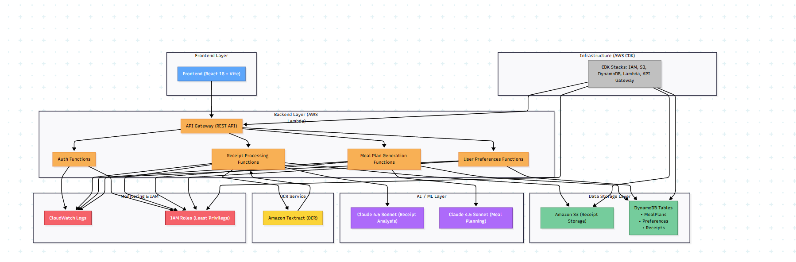

<div align="center">
  
  <h1>savr.ai — Autonomous Meal Planning Agent</h1>
  <p>Scan grocery receipts. Get personalized meal plans. Powered by AWS & AI.</p>
  
  **[Live Demo](https://savr-ai-one.vercel.app)** | **[Documentation](./DEPLOYMENT_GUIDE.md)**
</div>

---

## Project Overview

**savr.ai** scans grocery receipts and turns purchases into personalized, actionable meal plans. Designed for fast deployment, this project combines receipt OCR (Amazon Textract), AI reasoning (Amazon Bedrock/Claude), and a serverless AWS backend to deliver intelligent meal recommendations based on dietary restrictions, allergies, and budget constraints.

### Key Highlights

- Upload grocery receipts (image/PDF)
- Parse items & prices with Amazon Textract
- Enrich and reason about groceries using Bedrock (Claude 3.5 Sonnet)
- Generate weekly meal plans tailored to diet, allergies, and budget
- Session-based user persistence with DynamoDB

---

## Features

- **Receipt Scanning** - Extracts purchased items using Amazon Textract OCR
- **AI Reasoning Engine** - Generates meal plans via Claude 3.5 Sonnet on Amazon Bedrock
- **Agent Orchestration** - Uses Bedrock AgentCore for reasoning and tool calling
- **Data Management** - Stores user profiles, receipts, and meal plans in DynamoDB
- **Serverless Backend** - Built with AWS Lambda and API Gateway
- **Responsive Dashboard** - React + Vite + Vercel web app
- **Monitoring & Analytics** - CloudWatch and X-Ray for logging

---

## Tech Stack

| Layer | Technologies |
|-------|-------------|
| **Frontend** | React 18, Vite, Axios, React Router |
| **Backend** | AWS Lambda (Python 3.9), API Gateway |
| **AI/ML** | Amazon Bedrock (Claude 3.5 Sonnet), Amazon Textract |
| **Database** | DynamoDB |
| **Storage** | S3 |
| **Infrastructure** | AWS CDK, CloudFormation |
| **Deployment** | Vercel (Frontend), AWS (Backend) |

---

## Repository Structure

```
savr.ai/
├── frontend/              # React + Vite application
│   ├── src/
│   │   ├── pages/        # Dashboard, ReceiptScan, etc.
│   │   ├── components/   # Reusable UI components
│   │   ├── services/     # API integration
│   │   └── context/      # State management
│   └── public/           # Static assets
│
├── backend/
│   └── lambdas/          # Python Lambda functions
│       ├── analyze_receipt_ai/    # AI-powered analysis
│       ├── parse_receipt/         # Textract OCR
│       ├── generate_plan/         # Meal plan generation
│       ├── get_meal_plan/         # Retrieve plans
│       ├── preferences/           # User preferences
│       └── api_upload/            # S3 presigned URLs
│
└── infra/                # AWS CDK infrastructure
    └── stacks/           # Infrastructure definitions
```

---

## Architecture

**High-Level Flow:**

1. Frontend uploads receipts via presigned S3 URLs (Lambda generates URL)
2. Textract (`parse_receipt` Lambda) extracts items/prices from receipt
3. AI analysis Lambda (`analyze_receipt_ai`) calls Bedrock (Claude) for categories, recipes, health & budget insights
4. Meal planning generation uses Bedrock and stores plans in DynamoDB
5. Frontend retrieves and displays personalized meal plans

**System Architecture Diagram:**



---

## Getting Started

### Prerequisites

- Node.js 18+ and npm
- Python 3.9+
- AWS Account with configured credentials (`aws configure`)
- AWS Bedrock access (request Claude 3.5 Sonnet model access)
---

## API Endpoints

| Endpoint | Method | Description |
|----------|--------|-------------|
| `/upload` | POST | Request presigned S3 URL for receipt upload |
| `/parse-receipt` | POST | Parse uploaded receipt with Textract |
| `/analyze-receipt` | POST | AI-powered analysis with Bedrock |
| `/generate-plan` | POST | Generate meal plan from preferences |
| `/meal-plan` | GET | Fetch stored meal plan by userId |

**Example Request:**
```bash
curl -X POST https://your-api-url/upload \
  -H "Content-Type: application/json" \
  -d '{"fileName": "receipt.jpg", "contentType": "image/jpeg", "userId": "user123"}'
```

---

## AWS Cost Estimation

Expected monthly costs (light usage):
- Lambda: $0-5
- DynamoDB: $0-2
- S3: $0-1
- API Gateway: $0-3
- Bedrock AI: $5-20 (usage-based)
- **Total: ~$10-30/month**

---

<div align="center">
  <p><strong>Built with AWS, React, and AI</strong></p>
  <p>© 2025 Savr.ai Dev Team</p>
</div>
